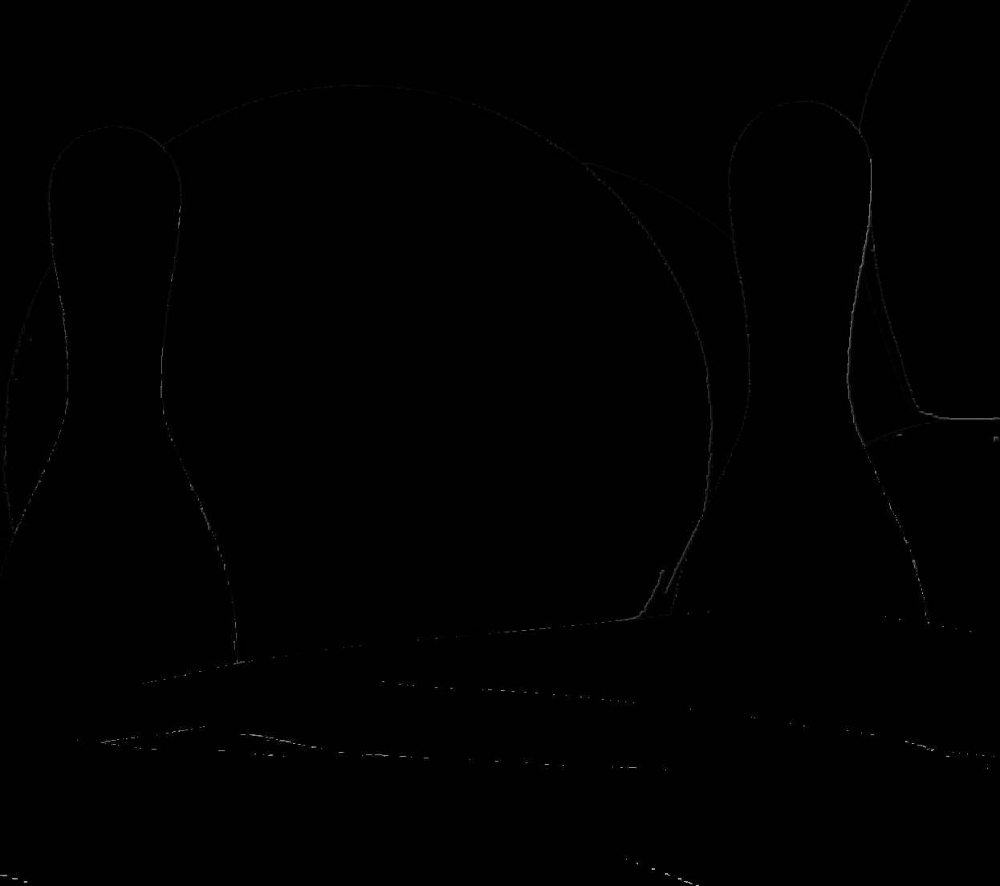

# HW2 - Data-level fusion
## Purpose
The goal is to define a set of filters to up-sample a disparity map using a joint guide image and reconstruct a point cloud using those algorithms
## Installation and usage
The project is cMake based, make sure you have make, cmake, and a c++ 11 compiler installed and the OpenCV library PATH variable properly set: you can either set a local build's path in the CMakeList.txt adding the line
```
set(OpenCV_DIR "<your OpenCV build directory>")
```
You can build and run the solution with:
```
cmake .
make
./Second_Assignment
```
## Approach
### Code organisation
For a better code organisation, the software has been partitioned in four parts:
- main
- Filters
- Evaluator
- PointCloud

The correct approach while developing this kind of library is to define static functions that are using some datastructures within a namespace letting the user manage properly the memory. In my case, to speed up the developing process and delegate the results tracking to separate spaces, I directly used classes exposing only basics function preferring separation to a correct usage of OOP.

The `main` program parses the parameters passed from the user command, creates an Evaluator object and gets the required results testing different values for the spatial and spectral sigma.
A second version of the main has been developed to implement a required GUI: indeed, using OpenCV's trackbars, lets you explore the effects of the two sigma value variation on the algorithm performance. This is done showing the image processed with those parameters and the difference with the ground truth. You can find this version commented in the `main.c ` file.
Once it's launched it looks like this:


`Filters` is a library that contains all the functions operating on the images; the implemented functions are:
- Bilateral Filter
- Bilateral Median Filter
- Joint Bilateral Filter
- Joint Bilateral Up-sampling
- Iterative Up-sampling

`Evaluator` is the object representing the computational core that keeps track of all the filtering that are done and produces first the filtered image with the selected method and parameters, and, after storing it, generates a `data.csv` file that contains the file name, the algorithm used, three metrics calculated in comparison with the ground truth (SSD, SSIM, and NCC).
It is built with
- window size to decide the dimension of the Gaussian mask generated by the filters.
- Two intervals: one for the spatial sigma and one for the spectral one.
- The algorithm you want to use from the filters' library
- A `std::vector` of files to be processed with that algorithm using the sigma values in the two ranges

As already mentioned, the construction of this object and the methods' signatures are violating all the good OOP paradigms but are a separation solution in respect of the monolithic boilerplate we were starting with.

`PointCloud` generates the 3D representation of a disparity map  and stores it in an internal `Point` representation.
### Solution evaluation
To analyse the performances of the algorithm, I started from a single image processing it for various window sizes, lambda and scaling factors. After finding the more performant ones, I tested those values to see if the performance degrades or increases with other stereo couples.

## Results
All data and graphs showed in this section, are gathered on [this spreadsheed](https://docs.google.com/spreadsheets/d/1po3v2SlgLVpUNGhqLR-66ialnmuUQeDJnDyP8kqS41c/edit?usp=sharing).
After developing the algorithms, I tested them with the **[Middelbury 2005 dataset ](https://vision.middlebury.edu/stereo/data/scenes2005/)** and the **[Middelbury 2006 dataset ](https://vision.middlebury.edu/stereo/data/scenes2006/)**.
In particular, I decided to start from the stereo couple we were using during this semester class, [Art](https://vision.middlebury.edu/stereo/data/scenes2005/FullSize/Art/).
I run the algorithm with the following parameter:
- a spatial sigma from 0.0 (uses the system default that I copied from the OpenCV implementation that is performing very well) to 2.0 with 0.25 increment;
- a spectral sigma from 5 to 105 with steps of 25

The formula for the kernel sigma from OpenCV is the following:

$ 0.3 * { { ks - 1 } * 0.5 - 1} + 0.8 $

To get generic useful information, I started comparing the values of the three metrics I have chosen:
- SSD
- SSIM
- NCC

### Filters' performance

Let's see how the 4 filters are working on the best performing picture (in average).


| Dolls Bilateral Filter                                                                                  | Diff with the OpenCV implementation                                                                                            |
|---------------------------------------------------------------------------------------------------------|--------------------------------------------------------------------------------------------------------------------------------|
|  |  |
| *Spectral Sigma: 6 Spatial Sigma: 1.25*                                                                 |

| Art Bilateral Median Filter                                                                        | Diff with the OpenCV implementation                                                                                           |
|----------------------------------------------------------------------------------------------------|-------------------------------------------------------------------------------------------------------------------------------|
|  |  |
| *Spectral Sigma: 4 Spatial Sigma: 1.25*                                                            |                                                                                                                               |

| Baby Joint Bilateral Filter                                                                                       | Diff with the OpenCV implementation                                                                                            |
|-------------------------------------------------------------------------------------------------------------------|--------------------------------------------------------------------------------------------------------------------------------|
|  |  |
| *Spectral Sigma: 6 Spatial Sigma: 1.00*                                                                           |

| Bowling Joint Bilateral Upsampling                                                                                                  | Diff with the OpenCV implementation                                                                                                |
|-------------------------------------------------------------------------------------------------------------------------------------|------------------------------------------------------------------------------------------------------------------------------------|
|  |  |
| *Spectral Sigma: 6 Spatial Sigma: 1.00*                                                                                             |


### Other image performances
Here you have a table with some other image for comparison (the best algorithm for the best performance):

| Filtered                                                                 | Diff                                                                     |
|--------------------------------------------------------------------------|--------------------------------------------------------------------------|
| Aloe JBU                                                                 | spatialSigma: 1.25 spectralSigma: 6                                      |
| SSD: 100626000, SSIM: 93.35%, NCC: 99.38%                                | Execution time: 1682 ms                                                  |
|              |        |
| Books JBU                                                                | spatialSigma: 1.00 spectralSigma: 6                                      |
| SSD: 205055000, SSIM: 94.24%, NCC: 99.63%                                | Execution time: 3794 ms                                                  |
|            |       |
| Cloth JBU                                                                | spatialSigma: 1.00 spectralSigma: 6                                      |
| SSD: 49718100, SSIM: 96.39%, NCC: 99.86%                                 | Execution time: 1617 ms                                                  |
|            |       |
| Flowerpots JBU                                                           | spatialSigma: 1.00 spectralSigma: 6                                      |
| SSD: 129436000, SSIM: 95.63%, NCC: 99.75%                                | Execution time: 1878 ms                                                  |
|  |  |
| Lampshade JBU                                                            | spatialSigma: 1.00 spectralSigma: 6                                      |
| SSD: 74715800, SSIM: 95.80%, NCC: 99.80%                                 | Execution time: 1856 ms                                                  |
|    |   |
| Laundry JBU                                                              | spatialSigma: 1.00 spectralSigma: 20                                     |
| SSD: 103386000, SSIM: 94.77%, NCC: 99.77%                                | Execution time: 1831 ms                                                  |
|       |    |
| Moebius JBU                                                              | spatialSigma: 1.00 spectralSigma: 6                                      |
| SSD: 158124000, SSIM: 93.45%, NCC: 99.61%                                | Execution time: 1869 ms                                                  |
|        |     |
| Reindeer JBU                                                             | spatialSigma: 1.00 spectralSigma: 6                                      |
| SSD: 100672000, SSIM: 95.55%, NCC: 99.80%                                | Execution time: 1779 ms                                                  |
|      |    |

### Processing time

Here you can see how as the complexity of the algorithm increases, the execution time follows as well, with a small difference between the joint bilateral filter executed on the original size image and the joint bilateral up-sampling executed to up-sample the image to the same size so basically, using the same number of iterations.


### Sigmas vs quality metrics

Here I plotted the 3-dimensional spacial results for the two values of sigma in respect of the quality metrics in average for all the algorithms:

| Parameter               | Plot                   |
|-------------------------|------------------------|
| Minimum SSD: 45765300.0 |   |
| Maximum SSIM: 0.979742  |  |
| Maximum NCC: 0.998637   |   |