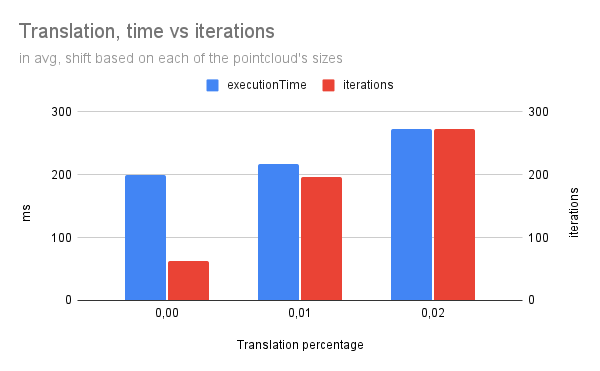
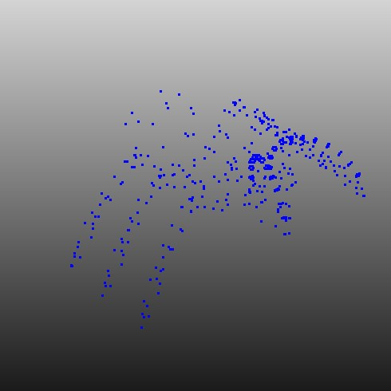

# HW2 - ICP, Tr-ICP
## Installation and usage
The project is cMake based, make sure you have make, cmake, and a c++ 11 compiler installed.
You can build and run the solution with:
```
cmake .
make
./Third_Assignment
```
## Approach
### Algorithms
As suggested from the indications on the assignment sheet, the program takes couples of point-clouds and performs 2 algorithms on them:
- ICP (Iterative closest point)
- Tr-ICP (Trimmed ICP)

illustrated during the classes. Those algorithms are in fact used to estimate the motion that aligns better the two point clouds.
This results useful when dealing with problems such as camera motion estimation, robotics orientation, etc.

To minimise distances between the point clouds, I used the Jacobian SVD (singular value decomposition) method.

These algorithms have been tested with different noise variances, different rotations between reference and source and even different translations.

As sources, I used three `.PLY` files taken from [Florida State University, Scientific Computer Dept.](https://people.sc.fsu.edu/~jburkardt/data/ply/ply.html)
The three files are differing in size, geometry, symmetry, and complexity:
- An airplane
- Beethoven's face
- An ant
### Code organisation
The repository contains two header-only external libraries in the form of submodules plus a copy of an Eigen version (3.4.0):
- Happly (submodule), that manages the acquisition/serialisation process for PLY files
- Nanoflann (submodule), that permits to generate and search Kd-Trees to index point clouds
- Eigen (headers copy), a powerful library for algebraic calculations.

A note about Nanoflann is that for some reasons (pay attention to the version of libeigen3-dev installed on your OS because if not specified, g++ tends to fetch the system one unless you don't use the quotes in your include directive e.g. `#include <lib>` vs `#include "lib.hpp"`).
For this reason I fetched a nanoflann Eigen adapter from another library, [OpenGP](https://github.com/OpenGP).

For a better code organisation, the software has been partitioned in two main parts:
- `main.cpp` that controls noise, translation, rotation, time management, measuraments, and result serialisation.
- `pcManager` a library that contains the two algorithms and other geometric functions used for the estimation.
  - `vecToEigen` and `EigenToVec` are used to move from the Happly format (`std::vector<std::array<double,3>>`) to my Eigen format (`Eigen::Matrix3Xd`)
  - `addNoise` is self explaining, adds noise on the structure of a point cloud
  - `rotoTranslatePointCloud` compute the rotation and translation of a point cloud
  - `pointDistance` computes the point to point distance
  - `interpolate` takes two point clouds and estimates the rotation and transformation needed to align them in the best way
  - `computeError` computes the average error between reference and source point cloud
  - `ICP` and `trICP` are performing the two ICP algorithms
  - `Distance` and `DistanceCriteria` are a struct and a comparator to order records in case of trimmed ICP

### Evaluation method

To evaluate every solution I used various parameters:
- The rotation estimation error
- The translation estimation error
- The absolute point cloud difference

All the results are available in tabular format on my [Google Drive spreadsheet](https://docs.google.com/spreadsheets/d/1gZRuvKJ9CmClWW1TZU2LgM_0VtAX1C8H8ixRN9yxHW4/edit?usp=sharing)

## Results
### Models
Here I show you the original models I used as input:

| Name and description              | Image                                                                 |
|-----------------------------------|-----------------------------------------------------------------------|
| Name: Ant<br/>#Points: 486        |                          |
| Name: Airplane<br/>#Points: 1335  |           |
| Name: Beethoven<br/>#Points: 2521 |  |

### Noisy rotations, translation and their computation for various parameters

Noise, rotations and translations have been computed based on the actual sizes of the point clouds;
apart from the case with zero impacts, every translation and noise variance is proportional to the average spread throug the three axis:
- Noise with variance 0%, 2% and 7% of the total point cloud space
- Random rotation angles of maximum 5°,20° or 50°
- Random translation from 0%, 1%, and 2% of the dimension proportioned to every axis

### Performance charts

Here I show the metrics I collected related to both the algorithms in different stress degree.

#### Influence of the size of the point-cloud
| Size vs Point2Point distance                               | Size vs Rotation estimation error                             | Size vs Translation Estimation Error                               |
|------------------------------------------------------------|---------------------------------------------------------------|--------------------------------------------------------------------|
|  |  |  |

To comment these charts, I need to say that the symmetry on two axes of the airplane's point-cloud has critically conditioned the 1335 points results but the most important thing we can see, is that the rotation estimation is better with a bigger point-cloud. 

#### Influence of rotation, translation and noise on performance

| Rotation vs Performance                                       | Translation vs Performance                               | Ant: Noise vs Performance                                              |
|---------------------------------------------------------------|----------------------------------------------------------|------------------------------------------------------------------------|
|  |  |  |

We can state that rotation doesn't influence massively the execution time being the average iteration number is inversely proportional to the time (so it's a casualty).
Translations and noise are instead influencing the execution time in a relative way.
The noise influence is quite more evident as you can see from the ant graph on the right.

#### Algorithm Comparison in average

| Rotation performance                                         | Translation performance                                           |
|--------------------------------------------------------------|-------------------------------------------------------------------|
|  |  |

My implementation of ICP diverges many times in comparison with the Tr-ICP and somehow, the rotation itself helps the algorithm to perform better. More stable, instead the performances of Tr-ICP that degrades a lot more with higher rotations.
While ICP care less, a bigger translation influences the final result of Tr-ICP that finds hard to get the right translations when too big.

### Algorithm comparison based on noise influence

| Rotation Quality                                                  | Translation Quality                                                    |
|-------------------------------------------------------------------|------------------------------------------------------------------------|
|  |  |

Out of the 2 outlier results in the robustness in respect of the translation and the rotations that I removed, we can see a constant performance of Tr-ICP in respect of the noise when estimating the rotation while ICP is more precise.
Talking about noise and translation, Tr-ICP is more robust and performs very well in respect of ICP.


## Conclusions
These comparisons are showing us the overall performance of the two algorithms:

| Name & Parameters                                           | GT                                                                      | Roto-translated noisy                                                                              | ICP                                                                      | Tr-ICP                                                                          |
|-------------------------------------------------------------|-------------------------------------------------------------------------|----------------------------------------------------------------------------------------------------|--------------------------------------------------------------------------|---------------------------------------------------------------------------------|
| Ant<br/>Noise: 2%<br/>Rotation: 20°<br/>Translation: 1%     |          |                    |                    |                    |
| Airplane<br/>Noise: 7%<br/>Rotation: 5°<br/>Translation: 2% |     |     |     |     |
| Bethoven<br/>Noise: 7%<br/>Rotation: 5°<br/>Translation: 2% |  |  |  |  |

while ICP works well with small point-clouds as you can see from the above pictures, Tr-ICP performs worst introducing some translation errors ( and computing more iterations).
When talking about bigger translations and very symmetric pointclouds, Tr-ICP generally converges while ICP outputs a result close to the expected one (still with orientation errors, those are critical cases).

|                                                        |
|--------------------------------------------------------------------------------------------------------|
| Tr-ICP completely failed while ICP computed something close to the real solution but with roll flipped |

Tr-ICP seems instead more robust in respect of noise while, because the methodology with which it solves the problem, ICP is not.
In fact, trimming the further points excludes outliers caused by noise.
A huge noise variance can introduce extremely wrong estimation like in the following case:

|                            |
|-----------------------------------------------------------------------------------------|
| ICP alignes the airplane with a 90° roll                                                |
|                   |
| Tr-ICP estimates with a bigger error but with less rotation error being the yaw correct |