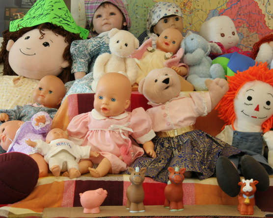
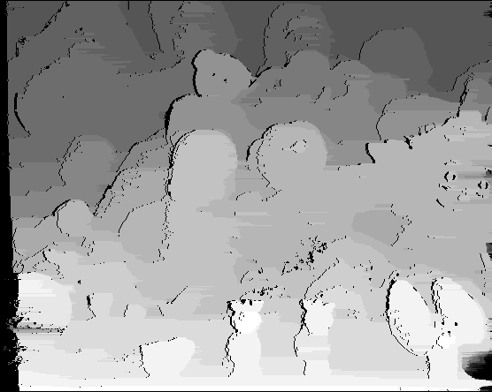

# 3DSS
Homeworks repository for 3D Sensing and Sensor Fusion's homeworks
## HW1
###Purpose
The goal is to define a set of functions/tools to compute a stereo match and create a point-cloud representing the image.
###Installation and usage
The project is cMake based, make sure you have make, cmake, and a c++ 11 compiler installed and the OpenCV library PATH variable properly set: you can either set a local build's path in the CMakeList.txt adding the line
```
set(OpenCV_DIR "<your OpenCV build directory>")
```
You can build and run the solution with:
```
cmake .
make
./First_Assignment IMAGE1 IMAGE2 <OUTPUT_FILE> <ws=WINDOW_SIZE> <f=FOCAL_LENGTH> <bl=BASELINE> <l=LAMBDA> <dm=DMIN> <gt=GROUND_TRUTH_FILENAME>
```
###Approach
####Code organisation
For a better code organisation, the software has been partitioned in three parts:
- main
- StereoMatcher
- PointCloud

The correct approach while developing this kind of library is to define static functions that are using some datastructures within a namespace letting the user manage properly the memory. In my case, to speed up the developing process and delegate the results tracking to separate spaces, I directly used classes exposing only basics function preferring separation to a correct usage of OOP.

The `main` program parses the parameters passed from the user command, creates a StereoMatcher solver with those parameters and gets the required results.
A second version of the main has been developed for testing purposes: indeed it cycles through a range of multiple parameters to produce a complete `metrics.csv` data report. You can find this version commented in the `main.c ` file.

`StereoMatcher` is the object representing the computational core that keeps track of all the matchings that are done and produces first the disparity map with the selected method, and, after storing it, generates a `PointCloud` object containing the estimated 3D representation of the image.
It is built with
- scaling factor to speed up the computation in spite of the resolution and point density.
- window size to decide how many pixel you want to analyse at the same time to define a matching score between the two images.
- camera parameters that are useful for a correct 3D reconstruction.
- lambda that is the matching cost used as occlusion similarity cost during the calculation of the dissimilarity map.

As already mentioned, the construction of this object and the methods' signatures are violating all the good OOP paradigms but are a separation solution in respect of the monolithic boilerplate we were starting with. Furthermore, I sometimes used references where c++ styled pointers were good. This increases the memory usage per run but makes super-easy the deletion process through a run with a scaling and another (the scaling is applied during the construction phase).

`PointCloud` generates the 3D representation of a disparity map  and stores it in an internal `Point` representation. To 
#### Solution evaluation
To analyse the performances of the algorithm, I started from a single image processing it for various window sizes, lambda and scaling factors. After finding the more performant ones, I tested those values to see if the performance degrades or increases with other stereo couples.

###Results
All data and graphs showed in this section, are gathered on [this spreadsheed](https://docs.google.com/spreadsheets/d/1JZK6mUIHSgMJi1FhgemK4L3JW0oQ1NyTb_5fO0MQ4t4/edit?usp=sharing).
After developing the algorithms, I tested them with the **[Middelbury 2005 dataset ](https://vision.middlebury.edu/stereo/data/scenes2005/)**.
In particular, I decided to start from the stereo couple we were using during this semester class, [Art](https://vision.middlebury.edu/stereo/data/scenes2005/FullSize/Art/).
I run the algorithm with the following parameter:
- a scaling factor from 20% to 100% with 20% increment;
- a matching window's size from 3x3 to 13x13 with a 2 element per size increment;
- a lambda occlusion cost of from 20px to 270px with a 50px increment;

To get generic useful informations, I started comparing the values of the three metrics I have chosen:
- SSD
- SSIM
- NCC

####Art dataset full-quality
The first analysis I wanted to do was the performance over lambda/window size couples for the full-size image (please ignore lambda values on naive approaches).
|SSD and SSIM|SSIM and NCC|
|---|---|
|||

As you can see, the best tradeoff are the couples window size 11 with lambda 120 and windows size 15 with both lambda 120 and 270.
The performance for those parameters are valid only for the fullsize image.
Here you have the execution times for them and a comparison of the Dynamic Programming solution with the Naive one in terms of squared differences, structural similarities and cross correlation:
|Execution time in respect of structural similarity|Accuracy|
|---|---|
|||
As you can see, with a window of 11x11 elements and the dynamic programming approach, the best structural similarity is reached through the DP method and even in a slightly quicker way. The sum of square differences drops on that point and the cross correlation is slightly better so I really think it's a good tradeoff point. Out of the performance itself, to compare the two methods, we can see that computational time obscillates between the 25 and the 40% less with the DP approach.
I also used an OpenCV implementation of the algorithm but the comparison with the ground truth is quite bad because out of the camera parameters, introduces other configuration sets to tune to perform better:
|Ground Truth|My implementation|OpenCV disparities|
|---|---|---|
||||

#### Downsampling
Using downsampling, instead, makes things faster and, being the same amount of information compressed in smaller images, performs better with smaller windows and, being the occlusions dimensions (in pixel) smaller, smaller lambda costs as you can see in this example for a 20% and 40% scaling (other data can be found on the spreadsheet linked before).
|Scaled 20%|Scaled 40%|
|---|---|
|||
Here, the low performance of the Naive approach, are evident. The difference in cross correlation is huge. As already said, with a smaller window size and smaller lambda costs, we're getting good performances on a scaled ground truth.
In case of 20%, the best performance is with a 3x3 window size and a lambda cost of 80.
In the 40% scaled images, the lambda cost influences less on the overall performance of the DP approach.
In both the scaling example we can also see a region of parameters that are not performant at all like a window size of 5 in the 20% scaled image. That's because the window itself becomes relevant in respect of the whole image dimension and a comperison between big regions is useless to find an accurate disparity.
In the same way, a lambda of 20 starts to have a smaller influence in a 40% scaled image.
####Other image performances
Here you have a table with some other image for comparison:
|Original left|Ground truth|My disparity|
|---|---|---|
|Moebious||
||||
|Book||
||||
|Doll||
||||
|Laundry||
||||
|Reindeer||
||||
The performances are the following:

As you can see, at this scaling factor we can reconstruct the disparity map in less than 3".
About the reconstruction quality, the processing time is not analysable because the differences are small. The quality and the depth density is varying a lot between scaled version.
This is a rendered reconstruction example:
